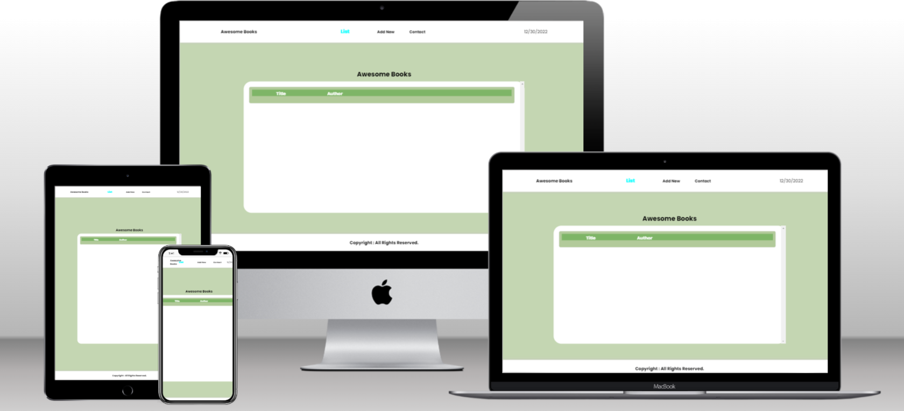

# Awesome Books 

> This is the Awesome books: plain JavaScript with objects that shows of my accomplishments as a software developer.

## Built With

- HTML
- CSS
- Javascript
- Webpack
- Es6
  
## 🚀 Live Demo 

Click here to see the [Live Demo](https://soesandarwin2201.github.io/es6.books.soesandarwin2201.github.io/) of the website 

## Getting Started

To get a local copy up and running follow these simple example steps.

### Prerequisites
- A simple web browser (preferably Chrome or Firefox)
- An IDE

### Setup
- Download this repository and open index.html file.

 # Author 1
 
👤 **Soe Sandar Win**

- GitHub: [@SoeSandarWin](https://github.com/soesandarwin2201)
- LinkedIn: [@SoeSandarWin](https://www.linkedin.com/in/soe-sandar-win-softwareengineer/)

## 🤝 Contributing

Contributions, issues, and feature requests are welcome!